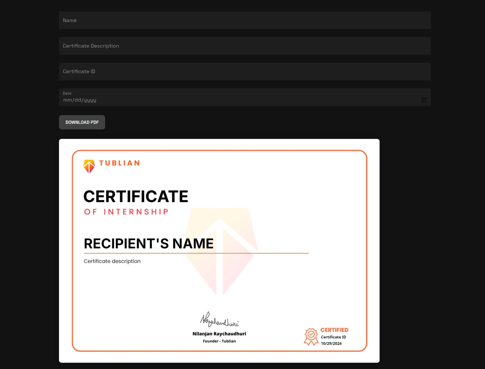
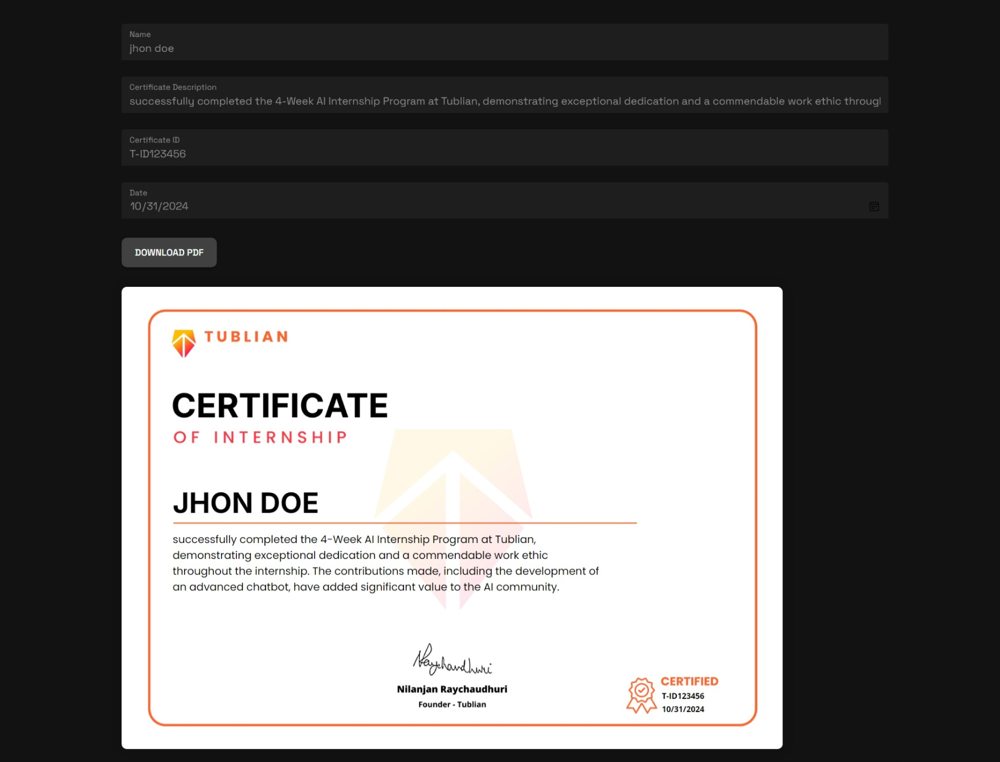

# TublianX Certificate Generator

An automated certificate generator built using React.js and Material UI to create, preview, and download certificates in PDF format. This app allows users to input recipient details, certificate ID, date, and a custom description, and then generate a customized certificate based on these inputs.

# Features

**Dynamic Certificate Generation**: Generate personalized certificates with the recipient's name, description, ID, and date.

**Live Preview**: Real-time display of the certificate in the browser with input data.

**Download as PDF**: Export the certificate as a high-quality PDF.

**Styling**: Dark theme with customizable fields and download button.

# Project Structure

tublian-certificate-generator/

├── public/

│   ├── index.html          # Root HTML file

│   └── ...                 # Other static files

├── src/

│   ├── assets/

│   │   └── certificate-template.png   # Certificate background image

│   ├── components/

│   │   ├── Certificate.js  # Component to render the certificate with input data

│   │   └── CertificateForm.js # Form component for user inputs

│   ├── App.js              # Main application component

│   ├── index.css           # Global styles

│   └── index.js            # React DOM rendering

└── README.md               # Documentation file

# Getting Started

Prerequisites

 - Node.js (>= 14.x)
 - npm or yarn for package management

# Installation

 - Clone the repository:

 git clone https://github.com/your-username/tublian-certificate-generator.git

 cd tublian-certificate-generator

 - Install dependencies:

 npm install

 - Run the application:

npm start

 - Open in the browser: Visit http://localhost:3000 to see the application in action.

# Dependencies

**React.js**: Frontend framework for building the UI.

**Material UI**: Component library for input fields and styling.

**html2canvas**: Used for rendering the certificate as an image.

**jsPDF**: Library for PDF generation.

# Usage

 - Enter the Name, Description, Certificate ID and Date in the form fields.

 - Preview the certificate with real-time updates.

 - Click Download PDF to generate and download the certificate.

# Customization

You can modify the project’s appearance and layout by adjusting styles in:

 -Certificate.js: To update positioning and font styling for certificate fields.

 -CertificateForm.js: For field and button styling, controlled by Material UI theme settings.

# Result

[Link to PDF](](src/assets/certificate.pdf)
